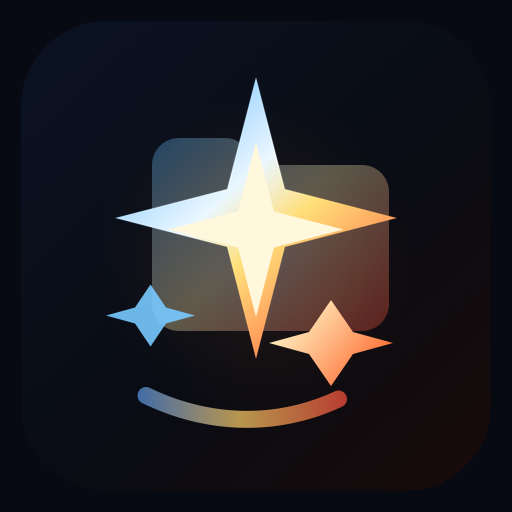
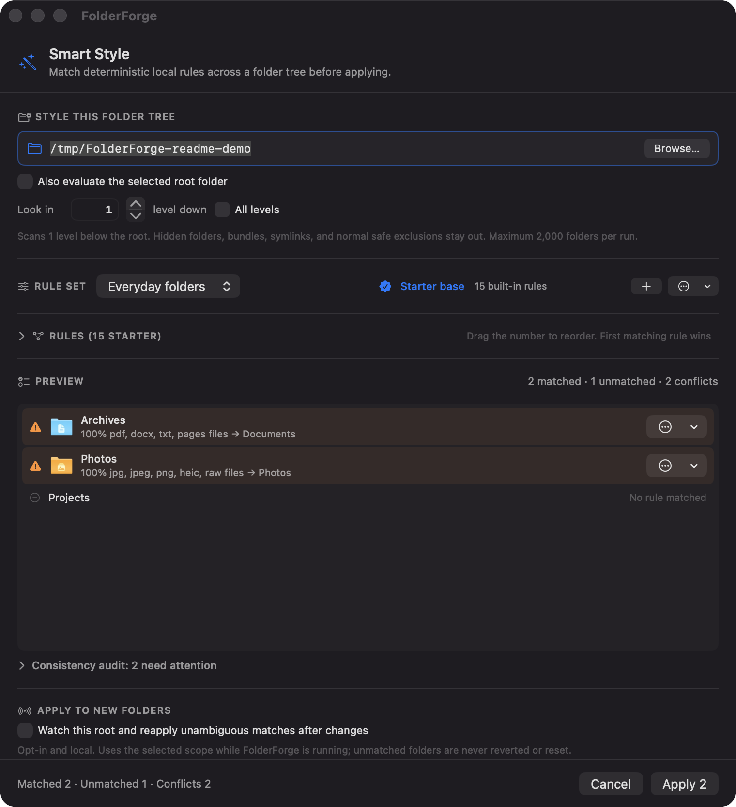

<div align="center">



# FolderForge

Customize macOS folder icons with colors, images, symbols, text, emoji, or ICNS files.

[Download notarized v1.0.6](https://github.com/KeplSiv/FolderForge/releases/download/v1.0.6/FolderForge-1.0.6.dmg) · macOS 14+


</div>

## Features

- Color and gradient folder designs
- Native macOS folder geometry with independent back, paper, and front layer fills
- Image fills with optional overlays
- SF Symbols, emoji, and text
- Full ICNS import
- Reusable presets and recursive folder imports
- Smart Style rules for applying designs across a folder tree
- Restore original icons and undo the last batch
- Native SwiftUI app with no third-party dependencies


## Smart Style

Smart Style matches folders by name, path, marker files, or file types. For example, every folder named `Receipts` can automatically use the same preset across an entire workspace. It shows every proposed change before anything is applied. Scans default to one level deep, skip common build and system folders, and stop at 2,000 folders.



## Install

Download the DMG from [Releases](https://github.com/KeplSiv/FolderForge/releases/latest), move FolderForge to Applications, then open it.

FolderForge 1.0.6 is signed with a Developer ID certificate and notarized by Apple.

To build it yourself:

```bash
git clone https://github.com/KeplSiv/FolderForge.git
cd FolderForge
./build.sh --run
```

Requires macOS 14+ and the Xcode command line tools.

## Safety and privacy

FolderForge works locally. It has no accounts, analytics, telemetry, or network features.

Before replacing a custom icon, FolderForge saves the original so it can be restored. It may request access to folders you choose. Finder Automation permission is only used when importing the current Finder selection.

See the [privacy policy](PRIVACY_POLICY.md).

## Command line

The app binary also provides a CLI:

```bash
FF=/Applications/FolderForge.app/Contents/MacOS/FolderForge
$FF --apply ~/Projects --preset Code
$FF --apply ~/Notes --color '#FF9F0A' --emoji '📓' --finish natural
$FF --apply ~/Code --recursive --exclude 'node_modules,dist,build' --dry-run
$FF --reset ~/Projects
$FF --help
```

## Development

```bash
swift test
./build.sh --run
./build.sh --dmg
```

FolderForge is built with Swift and SwiftUI. Licensed under the [MIT License](LICENSE).
