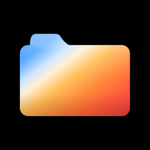
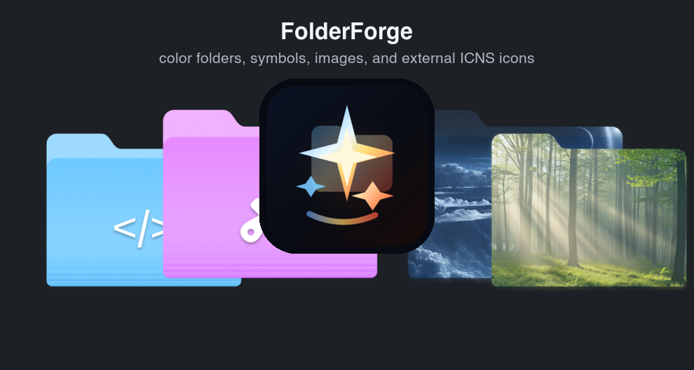
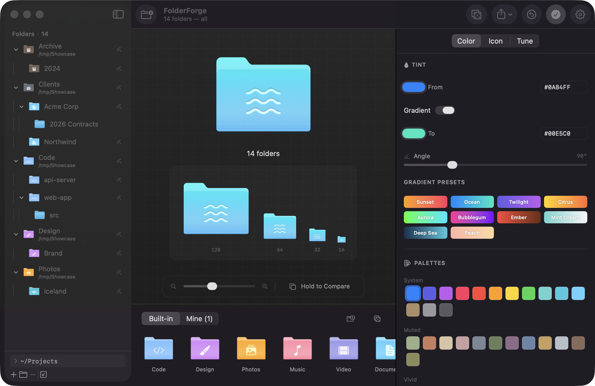
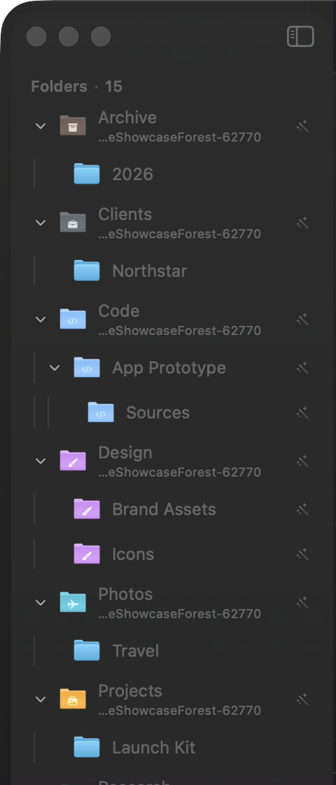
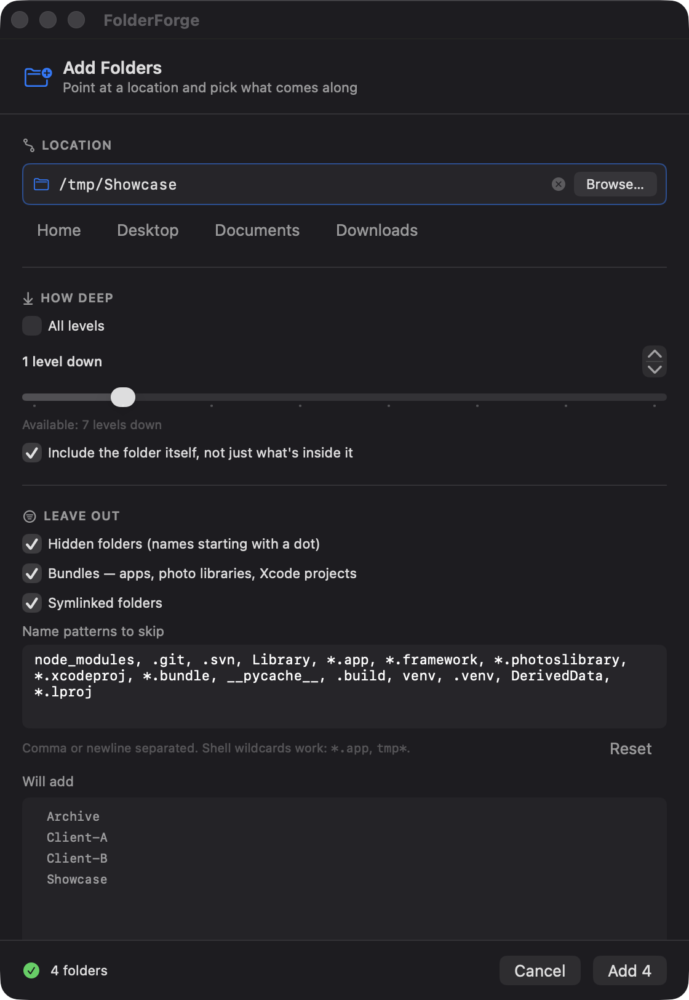
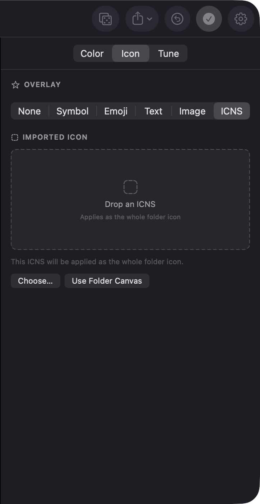
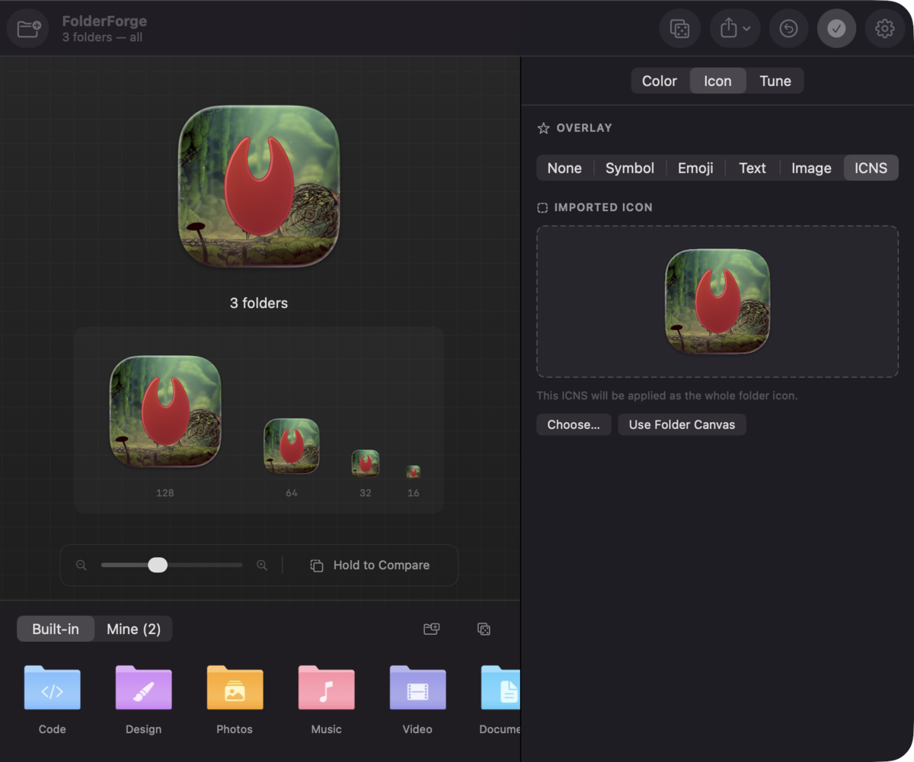
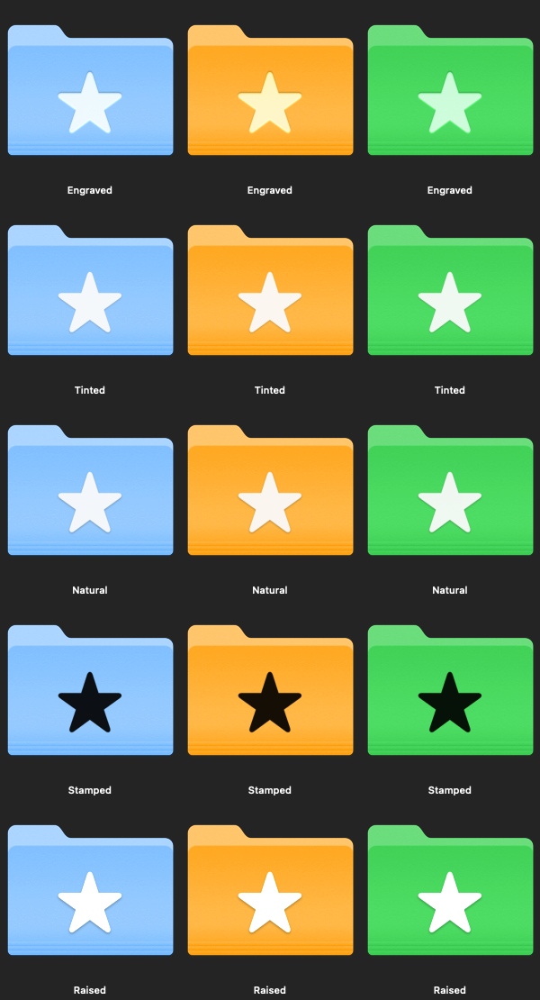

<div align="center">



# FolderForge

**A macOS folder icon designer.**
Pick a color, drop on a symbol, emoji, image or custom ICNS, and write it straight to your
folders — with a one-click path back to the originals.


[](https://github.com/KeplSiv/FolderForge/releases/latest/download/FolderForge.dmg)



</div>

---

## Contents

|                                                       |                                                                 |
| ----------------------------------------------------- | --------------------------------------------------------------- |
| [Install](#install)                                   | [What you can change](#what-you-can-change)                     |
| [Quick start](#quick-start)                           | [How the recoloring works](#how-the-recoloring-works)           |
| [The sidebar](#the-sidebar)                           | [Command line](#command-line)                                   |
| [Adding a whole tree](#adding-a-whole-tree)           | [Keyboard shortcuts](#keyboard-shortcuts)                       |
| [Restore & undo](#restore--undo)                      | [Behavior & edge cases](#behavior--edge-cases)                  |
| [ICNS references](#icns-references)                   | [Permissions](#permissions) · [Storage](#where-things-are-kept) |

---

## Install

```bash
git clone <this repo> && cd Folder_Customization

./build.sh --install     # builds and copies to /Applications
./build.sh --run         # builds into ./dist and launches
./build.sh --zip         # also produces dist/FolderForge.zip to hand to someone
```

Requires **macOS 14+** and the Xcode command line tools (`xcode-select --install`).
No Xcode project, no package dependencies.

> [!NOTE]
> The app is **ad-hoc signed**, not notarized. The first time you open a copy that was
> _downloaded_ rather than built locally, macOS refuses the double-click — right-click the
> app, choose **Open**, and confirm once.

---

## Quick start

<!-- 📸 screenshots/main-window.png -->



1. **Add folders** — four ways:
   - drag them into the sidebar
   - type or paste a path into the field at the bottom of the sidebar, press <kbd>↩</kbd>
   - <kbd>⌘O</kbd> opens the full **Add Folders** sheet (path entry, depth, exclusions)
   - <kbd>⇧⌘O</kbd> grabs whatever is selected in Finder
2. **Design the icon** in the inspector on the right.
3. Hit **Apply**.

Select nothing and Apply hits _every_ folder in the list; select some and it hits only those.
Every folder already carrying a FolderForge icon is loaded into the list automatically at
launch, so you can pick up where you left off.

---

## The sidebar

<!-- 📸 screenshots/sidebar-tree.png -->



Folders imported recursively **nest under their parent** rather than piling up as a flat
list. Each nesting level draws a vertical guide, so one recursive import reads as one
connected group.

- Click **anywhere in the indent column** — the whole vertical strip, not just the chevron —
  to collapse or expand a branch.
- Everything arrives **expanded**; collapsing is yours to opt into.
- The header counts what's loaded: `Folders · 19`.
- Badges: 🪄 styled by FolderForge · 🖼️ has a custom icon from somewhere else · nothing = plain.
- <kbd>⌫</kbd> removes the selection from the list. Right-click a row for Reveal in Finder,
  Load This Folder's Style, Restore Original Icon, Remove from List.

Removed some folders and want them back? **Settings → Customized folders → Add Them All to
the List**.

---

## Adding a whole tree

<!-- 📸 screenshots/add-folders.png -->



The Add Folders sheet starts with a path field that supports:

- `~` expansion
- tab-style completion
- shortcuts to Home, Desktop, Documents and Downloads

Then it asks:

- **How deep?** Pick an exact depth from the real folder tree, or choose all levels.
- **Include root?** Style `~/Clients` itself, or only the folders inside it.
- **What to leave out?** Hidden folders, bundles, symlinks and shell-glob patterns.

Before anything is added, FolderForge shows the exact collapsible tree it found. A 2000-folder
cap keeps huge scans from running away.

---

## Restore & undo

Restore puts the original icon back — the real one, not an approximation. The first time
FolderForge touches a folder, it snapshots whatever icon was already there.

- Folders that already had a custom icon get that exact icon back.
- Plain folders go back to the plain system folder.
- <kbd>⌥⌘Z</kbd> undoes the last batch apply.
- <kbd>⌥⌘C</kbd> / <kbd>⌥⌘V</kbd> copy and paste a design between folders.
- **Refresh Finder** nudges Finder when macOS is still showing a cached old icon.

> [!IMPORTANT]
> **Icons FolderForge didn't make can't be reverse-engineered into settings.** A custom icon
> on disk is just the final image — the tint, symbol and layout that produced it were never
> stored anywhere. FolderForge shows you the real icon, archives a copy before replacing it,
> and can import an external `.icns` as a complete replacement icon.

---

## What you can change

<!-- 📸 screenshots/inspector.png -->



### Color

Any color, or a two-color gradient at any angle. 60+ curated swatches and 10 gradient
presets. Tint strength blends back toward the stock macOS blue.

### Icon — 300+ SF Symbols, emoji, text, images or custom ICNS

Choose from:

- searchable SF Symbols
- emoji
- short text
- regular images placed on the folder canvas
- custom `.icns` files used as the whole folder icon

Images can be sized, faded, rotated and positioned freely. ICNS files stay complete: they
replace the folder icon instead of becoming an overlay.

External downloaded `.icns` files apply as complete icons:



<!-- 📸 screenshots/finishes.png -->



| Finish       | Looks like                                                     |
| ------------ | -------------------------------------------------------------- |
| **Engraved** | Carved into the folder face. Apple's own look — the default.   |
| **Tinted**   | Flat fill in a color you choose.                               |
| **Natural**  | Keeps the artwork's own colors. Use this for emoji and photos. |
| **Stamped**  | Dark ink pressed into the folder.                              |
| **Raised**   | Bright and glossy, floating above with a soft shadow.          |

Emoji and images carry their own colors, so picking one switches the finish to **Natural**
automatically — a masked finish would flatten them to white silhouettes. ICNS files are
applied as complete icons. Switching back to a symbol restores **Engraved**.

### Tune

Saturation, brightness, contrast, and five one-click looks: Vintage, Punchy, Pastel, Noir,
Neon.

### Shape

Start from any of the 15 stock macOS folder shapes, not just the plain one.

### Presets

Save anything you like as a preset. Presets export as `.folderstyle` files you can share, and
double-clicking one imports it.

---

## ICNS references

FolderForge can import `.icns` files from your Mac. Good places to find or make icons:

- Create your own `.icns` files.
- Browse [macOSicons](https://macosicons.com/).
- Browse [Icon-Icons](https://icon-icons.com/).

Notes:

- The Hollow Knight Silksong example in this README uses an external icon from
  [macOSicons](https://macosicons.com/?icon=kVqQ3Xg6Co).
- Check each icon's license before using it, especially for commercial or redistributed work.
- FolderForge does not bundle or redistribute third-party icons.

---

## How the recoloring works

### Why the results look native instead of painted

FolderForge keeps the native macOS folder look by preserving the original artwork's lighting.

- A `.color` blend replaces hue and saturation while keeping Apple's gradients, highlights and
  shadows intact.
- A second pass matches **HSB brightness** to the chosen tint, so very dark or pale colors land
  as expected.
- Icons render separately at 16, 32, 64, 128, 256, 512 and 1024 px, so small Finder sizes stay
  crisp.

HSB brightness is deliberate. Perceived luminance would make saturated colors like `#FF375F`
look much darker than people expect.

---

## Command line

The same binary is a CLI. Useful for dotfiles and setup scripts:

```bash
FF=/Applications/FolderForge.app/Contents/MacOS/FolderForge

$FF --apply ~/Projects --preset Code
$FF --apply ~/Notes --color '#FF9F0A' --emoji 📓 --finish natural
$FF --reset ~/Projects

# every immediate subfolder of ~/Clients, leaving ~/Clients itself alone
$FF --apply ~/Clients --depth 1 --no-root --preset Work

# a whole tree, skipping build output — look before you leap
$FF --apply ~/Code --recursive --exclude 'node_modules,dist,build' --dry-run
$FF --apply ~/Code --recursive --exclude 'node_modules,dist,build' --preset Code

$FF --reset ~/Code --recursive

$FF --export icon.png --preset Ocean --size 1024
$FF --export icon.png --image CustomIcon.icns
$FF --iconset MyIcon.iconset --preset Ocean
$FF --contact-sheet all.png          # every built-in preset in one grid
$FF --list-presets
$FF --help
```

Every style flag from `--help` works with `--apply`, `--export` and `--iconset`.

### Development aids

```bash
FolderForge --ui-snapshot out.png --width 900 --height 620 [--view main|sheet] [--tab color|icon|tune] [--overlay icns] [--icon file.icns]
FolderForge --debug-selection <folder...>
```

- `--ui-snapshot` renders the interface at an exact size using a real offscreen window.
- It needs an unlocked screen because the window server will not composite while the Mac is locked.
- `--debug-selection` prints what the editor adopts as the selection moves and needs no screen.

---

## Keyboard shortcuts

| Shortcut                        | Does                             |
| ------------------------------- | -------------------------------- |
| <kbd>⌘O</kbd>                   | Add Folders sheet                |
| <kbd>⌥⌘O</kbd>                  | Browse for folders               |
| <kbd>⇧⌘O</kbd>                  | Add the current Finder selection |
| <kbd>⌘↩</kbd>                   | Apply                            |
| <kbd>⇧⌘⌫</kbd>                  | Restore original                 |
| <kbd>⌥⌘Z</kbd>                  | Undo last apply                  |
| <kbd>⌥⌘C</kbd> / <kbd>⌥⌘V</kbd> | Copy / paste style               |
| <kbd>⌘R</kbd>                   | Surprise me                      |
| <kbd>⌘S</kbd>                   | Save as preset                   |
| <kbd>⌫</kbd>                    | Remove selection from the list   |

<kbd>⌘Z</kbd> is deliberately left to the system, so every text field in the app keeps its
normal undo. **Undo Last Apply** is <kbd>⌥⌘Z</kbd>.

---

## Behavior & edge cases

### Icons FolderForge didn't make

A custom folder icon on disk is **just the final image**, stored in the resource fork of a
hidden `Icon\r` file inside the folder.

- Tint, symbol, finish and layout settings are not recorded by macOS.
- FolderForge can show and archive the real icon.
- FolderForge cannot recover editable settings from an icon it did not create.
- External `.icns` files can still be imported as complete replacement icons.

| Folder state               | Sidebar badge | Preview shows                            |
| -------------------------- | ------------- | ---------------------------------------- |
| Styled by FolderForge      | 🪄 wand       | its saved design, loaded into the editor |
| Custom icon from elsewhere | 🖼️ photo      | the real icon, read off disk             |
| No custom icon             | none          | a plain stock folder                     |

The preview switches to your design the moment you change anything, so an existing icon never
gets in the way.

### Nothing destroys an icon without a copy first

- **`OriginalIcons/`** — before the first change to a folder, whatever icon was there is
  snapshotted. **Restore** puts that exact icon back. Folders that had no custom icon get a
  zero-byte sentinel instead, so Restore knows to _clear_ rather than paint.
- **`RemovedIcons/`** — restoring a folder whose icon FolderForge never made means clearing it
  outright, with no snapshot to fall back on. A timestamped copy is archived here first
  (Settings → **Open Archive**), capped at the newest 25. Only _foreign_ icons are archived; an
  icon FolderForge generated is fully reproducible from the style in the ledger, so copying it
  on every reset would burn megabytes for nothing.

A failed restore keeps its snapshot and reports an error rather than clearing the folder.

- Stored as LZW-compressed TIFFs, preserving every icon representation.
- Around 8 MB for an elaborate icon; far less for a normal one.
- Created only for folders that already had custom icons.
- Pruned at launch and via Settings → **Clean Up Snapshots for Deleted Folders**.
- Pruning only drops entries whose recorded path is gone.

### Selection drives the editor

Selecting a folder loads whatever that folder is:

- Saved FolderForge design: loads into the editor.
- Plain folder: shows a plain folder.
- Mixed selection: leaves the current design alone because there is no single design to show.

Unsaved work is never silently discarded. If a selection change would replace your current
design, FolderForge puts it on the style clipboard and tells you to press <kbd>⌥⌘V</kbd> to
bring it back.

### Apply and Restore with nothing selected

When nothing is selected, Apply and Restore target every folder in the list.

- If the list has more than one folder, FolderForge asks for confirmation first.
- Batches run asynchronously, so the progress bar can draw and **Stop** works.
- Large batches yield between folders instead of freezing the app.

### Scanning rules

- The scan runs off the main thread, debounced ~200 ms. Typing a single `/` with "All levels"
  selected walks the entire disk; doing that synchronously on every keystroke froze the window.
- Breadth-first, so a shallow depth limit costs nothing and the 2000-folder cap truncates at the
  top of the tree rather than deep inside one branch.
- Exclusion patterns use `fnmatch` with `FNM_CASEFOLD`, so `*.APP` matches `MyApp.app` and
  `node_modules` matches `NODE_MODULES`. Patterns containing `/` match the full path with
  `FNM_PATHNAME`, so `*` won't leap across directory separators.
- Bundles (`.app`, `.photoslibrary`, `.xcodeproj`) are directories on disk but are skipped by
  default — customizing them is never what's meant.
- Symlinked directories are skipped by default. The 2000-folder cap is what stops a symlink
  cycle if you turn that off.
- The root folder you name is always included regardless of exclusion patterns — you asked for
  it explicitly. Use `--no-root` to leave it out.

### Paths

`~` expands. A bare relative path is tried against the working directory first (what you'd
expect from the CLI) and then against home (what you'd expect typing `Projects` into the app).
Quoted and backslash-escaped paths pasted from a terminal are accepted.

### Known limits

- Settings can't be recovered from an existing icon FolderForge didn't make.
- Icons are re-rendered at each size (16 → 1024), but the stock artwork being recolored tops out
  at whatever macOS ships.
- Multicolor SF Symbols render as a single-color mask; palette and hierarchical rendering modes
  aren't exposed.
- Ad-hoc signed, not notarized — a downloaded copy needs right-click → **Open** once.

---

## Permissions

FolderForge may trigger two macOS permission prompts:

- **Files and Folders** — needed to write custom icons inside Desktop, Documents or Downloads.
- **Automation** — needed only for reading the current Finder selection with <kbd>⇧⌘O</kbd>.

Grant them in **System Settings › Privacy & Security**. Everything else works without Finder
Automation access.

---

## Where things are kept

```
~/Library/Application Support/FolderForge/
  presets.json      your saved styles
  applied.json      which design is on which folder
  OriginalIcons/    pre-first-change snapshots (+ .none sentinels)
  RemovedIcons/     foreign icons that were cleared
```

Deleting that directory:

- removes saved presets
- removes exact original-icon snapshots
- does not damage folders themselves

Without the snapshot ledger, **Restore** falls back to the plain system folder.

---

## Project layout

```
Sources/FolderForge/
  App/        Entry (CLI vs GUI), AppState, App + menus
  Core/       Model, renderer, glyph rasterizer, disk I/O, presets, scanner, CLI
  UI/         ContentView, sidebar, preview, inspector, pickers, sheets
Resources/    AppIcon.svg — the app icon, in vector
Scripts/      svg2png.swift — rasterizes the icon at each iconset size
build.sh      Produces dist/FolderForge.app
screenshots/  Images used by this README
```

Notes for contributors:

- The app icon is rendered from `Resources/AppIcon.svg` at build time, once per iconset size.
- Edit the SVG and re-run `./build.sh` to change the app icon.
- `Core/IconRenderer.swift` has no UI dependencies and is driven by `FolderStyle`.
- The CLI, live previews and applied icons all call the same renderer, so they stay in sync.

<div align="center">

---

Built with SwiftUI. No dependencies, no telemetry, no network.

</div>
